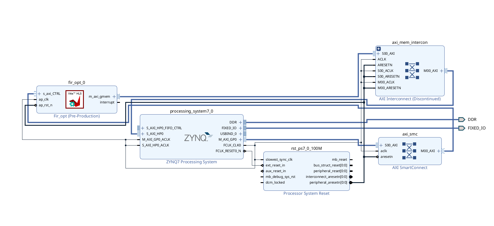
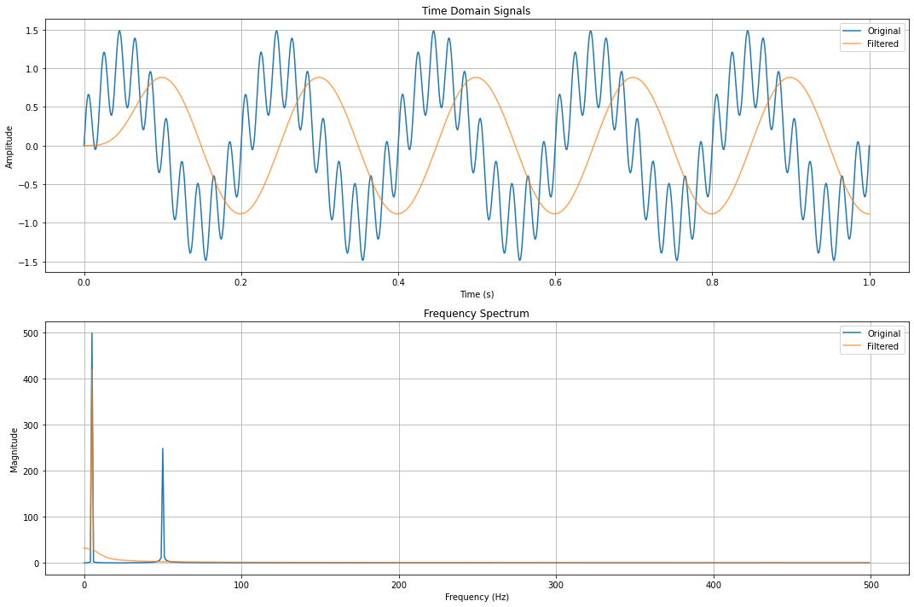

# FIR Filter Optimization on PYNQ-Z2

This project demonstrates the implementation and optimization of a Finite Impulse Response (FIR) filter on the PYNQ-Z2 FPGA platform, operating at 50MHz. The optimization focuses on improving performance through loop splitting, unrolling, and pipelining techniques.

## Project Structure

```
FIR_FILTER/
├── part01_vitis/
│   ├── base/
│   │   ├── hls_report/
│   │   ├── synthesis_report/
│   │   └── fir_base.cpp
│   ├── optimized/
│   │   ├── hls_report/
│   │   ├── synthesis_report/
│   │   └── fir_opt.cpp
│   ├── fir_tb.cpp
│   ├── fir.h
│   └── hls_config.cfg
├── part02_vivado/
│   ├── overlays/
│   ├── report/
│   └── block_design.png
├── fir_fpga.ipynb
└── README.md
```

## Implementation Overview

The FIR filter implementation showcases significant performance improvements through various HLS optimization techniques. The base implementation was enhanced by:

- Splitting the shift registers and accumulate operations into separate loops
- Implementing loop unrolling for parallel processing
- Utilizing pipelining to improve throughput
- Operating at 50MHz clock frequency

### Performance Analysis

Comparing the base and optimized implementations:

**Base Implementation:**

- Total Latency: 10,926 cycles
- Iteration Interval: 10,927 cycles
- Resource Usage:
  - BRAM: 7 (2%)
  - DSP: 6 (2%)
  - FF: 1,729 (1%)
  - LUT: 1,942 (3%)

**Optimized Implementation:**

- Total Latency: 331 cycles (33x improvement)
- Iteration Interval: 332 cycles
- Resource Usage:
  - BRAM: 4 (1%)
  - DSP: 150 (68%)
  - FF: 17,767 (16%)
  - LUT: 8,331 (15%)

The optimized design achieves a significant speedup of approximately 33x while trading off increased DSP and LUT usage for improved performance.

## Hardware Integration

The Vitis HLS IP was successfully integrated into Vivado for implementation on the PYNQ-Z2 board. The design files can be found in the `part02_vivado` folder, including:

- Block design files
- Synthesis reports
- Implementation overlays

### Block Design



The block design incorporates:

- AXI-lite interface for control
- DMA for efficient data transfer
- Memory-mapped interface for coefficient loading

## Software Implementation

The implementation was verified using a Jupyter notebook that:

1. Generated test signals:

   - Low frequency (5 Hz) component
   - High frequency (50 Hz) component
   - Combined signal for testing
2. Created FIR filter coefficients:

   - Utilized scipy.signal for coefficient generation
   - Implemented cutoff frequency selection
   - Scaled coefficients for fixed-point arithmetic
3. Processed and visualized results:

   - Time domain comparison
   - Frequency spectrum analysis
   - Verification of filter response

## Results

The implementation successfully demonstrated:

- Effective removal of high-frequency components
- Preserved low-frequency signal integrity
- Expected phase delay due to FIR filter characteristics
- Resource-efficient implementation on FPGA

### Output Visualization



The output plots show:

- **Time Domain**: Clear filtering of the 50 Hz component while maintaining the 5 Hz signal with expected phase delay
- **Frequency Spectrum**: Successful lowpass filtering with attenuation of the 50 Hz component while preserving the 5 Hz base signal
